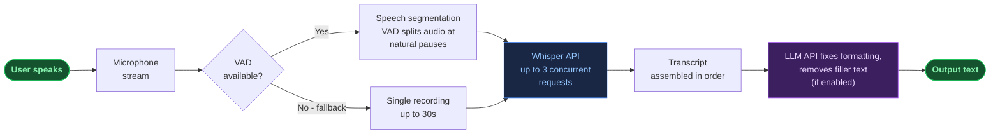
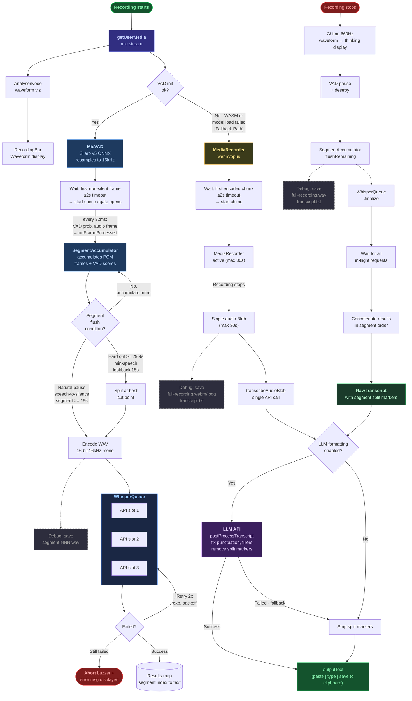

# Unhush Speech to Text Pipeline

## Overview

```mermaid
flowchart LR
    START(["`**User speaks**`"]) --> MIC["`Microphone
    stream`"]

    MIC --> VAD{"`VAD
    available?`"}

    VAD -->|Yes| SEG["`Speech segmentation
    VAD splits audio at
    natural pauses`"]
    VAD -->|No - fallback| FB["`Single recording
    up to 30s`"]

    SEG --> WQ["`Whisper API
    up to 3 concurrent
    requests`"]
    FB --> WQ

    WQ --> FINAL["`Transcript
    assembled in order`"]
    FINAL --> LLMAPI["`LLM API fixes formatting,
    removes filler text
    (if enabled)`"] --> PASTE(["`**Output text**`"])

    style START fill:#14532d,stroke:#22c55e,color:#86efac
    style PASTE fill:#14532d,stroke:#22c55e,color:#86efac
    style WQ fill:#1a2744,stroke:#3b82f6,color:#93c5fd
    style LLMAPI fill:#3b1f5e,stroke:#a855f7,color:#e9d5ff
```

## Detailed Pipeline

```mermaid
flowchart TD
    START(["`**Recording starts**`"]) --> MIC
    MIC["`**getUserMedia**
    mic stream`"]

    MIC --> AN["`AnalyserNode
    waveform viz`"]
    MIC --> VADINIT{"VAD init
    ok?"}

    AN --> WAVE["`RecordingBar
    Waveform display`"]

    VADINIT -->|Yes| VAD["`**MicVAD**
    Silero v5 ONNX
    resamples to 16kHz`"]
    VAD --> FIRSTFRAME["`Wait: first non-silent frame
    ≤2s timeout
    → start chime / gate opens`"]
    FIRSTFRAME -->|"`every 32ms:
    VAD prob, audio frame
    → onFrameProcessed`"| CA["`**SegmentAccumulator**
    accumulates PCM
    frames + VAD scores`"]

    CA --> FLUSH{"Segment
    flush
    condition?"}
    FLUSH -->|"`Natural pause
    speech-to-silence
    segment >= 15s`"| ENCODE["`Encode WAV
    16-bit 16kHz mono`"]
    FLUSH -->|"`Hard cut >= 29.9s
    min-speech
    lookback 15s`"| SPLIT["`Split at best
    cut point`"]
    FLUSH -->|No,
    accumulate more| CA
    SPLIT --> ENCODE

    ENCODE -.-> DBG_CHUNK["`Debug: save
    segment-NNN.wav`"]:::debug
    ENCODE --> WQ

    subgraph WQ ["`**WhisperQueue**`"]
        direction LR
        SLOT1["API slot 1"]
        SLOT2["API slot 2"]
        SLOT3["API slot 3"]
    end

    WQ --> RETRY{"Failed?"}
    RETRY -->|"`Retry 2x
    exp. backoff`"| WQ
    RETRY -->|Still failed| ABORT(["`**Abort** buzzer +
    error msg displayed`"])
    RETRY -->|Success| RESULTS[("`Results map
    segment index to text`")]

    STOP([Recording stops]) --> STOPUI["`Chime 660Hz
    waveform → thinking display`"]
    STOPUI --> VADPAUSE["`VAD pause
    + destroy`"]
    VADPAUSE --> FLUSHREM["`SegmentAccumulator
    .flushRemaining`"]
    FLUSHREM -.-> DBG_FULL["`Debug: save
    full-recording.wav
    transcript.txt`"]:::debug
    FLUSHREM --> FINALIZE["`WhisperQueue
    .finalize`"]
    FINALIZE --> WAIT["`Wait for all
    in-flight requests`"]
    WAIT --> CONCAT["`Concatenate results
    in segment order`"]
    CONCAT --> TRANSCRIPT["`**Raw transcript**
    with segment split markers`"]
    TRANSCRIPT --> LLMCHECK{"`LLM formatting
    enabled?`"}
    LLMCHECK -->|Yes| LLMPASS["`**LLM API**
    postProcessTranscript
    fix punctuation, fillers
    remove split markers`"]
    LLMCHECK -->|No| STRIPMARKERS["`Strip split markers`"]
    LLMPASS -->|Success| PASTE["`outputText
    (paste | type | save to clipboard)`"]
    LLMPASS -->|Failed - fallback| STRIPMARKERS
    STRIPMARKERS --> PASTE
    DIRECT --> LLMCHECK

    VADINIT -->|"`No - WASM or
    model load failed
    [Fallback Path]`"| MR["`**MediaRecorder**
    webm/opus`"]
    MR --> FIRSTCHUNK["`Wait: first encoded chunk
    ≤2s timeout
    → start chime`"]
    FIRSTCHUNK --> MRACTIVE["`MediaRecorder
    active (max 30s)`"]
    MRACTIVE -->|Recording stops| BLOB["Single audio Blob
    (max 30s)"]
    BLOB -.-> DBG_FB["`Debug: save
    full-recording.webm/.ogg
    transcript.txt`"]:::debug
    BLOB --> DIRECT["`transcribeAudioBlob
    single API call`"]

    classDef debug fill:#2d2d3d,stroke:#666,stroke-dasharray: 5 5,color:#999
    style WQ fill:#1a2744,stroke:#3b82f6,color:#93c5fd
    style START fill:#14532d,stroke:#22c55e,color:#86efac
    style STOP fill:#7f1d1d,stroke:#ef4444,color:#fca5a5
    style MIC fill:#312e81,stroke:#818cf8,color:#c7d2fe
    style VAD fill:#1e3a5f,stroke:#60a5fa,color:#bfdbfe
    style CA fill:#1e3a5f,stroke:#60a5fa,color:#bfdbfe
    style MR fill:#3b3b1a,stroke:#ca8a04,color:#fde68a
    style ABORT fill:#7f1d1d,stroke:#ef4444,color:#fca5a5
    style LLMPASS fill:#3b1f5e,stroke:#a855f7,color:#e9d5ff
    style TRANSCRIPT fill:#1a3a2a,stroke:#4ade80,color:#bbf7d0
    style PASTE fill:#14532d,stroke:#22c55e,color:#86efac
```
